# 01E-COM Microservices Infrastructure & CI/CD Pipeline

A robust, enterprise-grade e-commerce backend built with **Spring Boot** and **Angular**, powered by a fully automated **Jenkins** CI/CD pipeline, **Nexus Repository Manager** for artifact/Docker hosting, and end-to-end **Playwright** testing.

---

## 🏗️ Architecture Overview

The system consists of six Spring Boot microservices, an Angular single-page frontend application, and a localized infrastructure stack for artifact storage, code quality analysis, and container orchestration.

```
                    ┌──────────────────────────────────────────────┐
                    │            Jenkins CI/CD Pipeline             │
                    └──────────────────────┬───────────────────────┘
                                           │
         ┌─────────────────────────────────┼─────────────────────────────────┐
         │                                 │                                 │
         ▼                                 ▼                                 ▼
┌───────────────────┐            ┌───────────────────┐            ┌───────────────────┐
│ Nexus Repositories│            │ Code Quality Gate │            │  E2E Test Suite   │
│ - maven-snapshots │            │ - SonarQube       │            │ - Playwright      │
│ - maven-releases  │            │ - JaCoCo Coverage │            │ - Headless Chrome │
│ - docker-hosted   │            └───────────────────┘            └───────────────────┘
│ - docker-proxy    │
└────────┬──────────┘
         │
         ▼
┌─────────────────────────────────────────────────────────────────────────────────────┐
│                             Application Stack (Docker)                              │
│                                                                                     │
│  ┌────────────────────────┐    ┌──────────────────────┐    ┌─────────────────────┐  │
│  │    gateway_service     │    │     user_service     │    │   product_service   │  │
│  │      (Port 8089)       │    └──────────────────────┘    └─────────────────────┘  │
│  └───────────┬────────────┘    ┌──────────────────────┐    ┌─────────────────────┐  │
│              │                 │    media_service     │    │    cart_service     │  │
│              ▼                 └──────────────────────┘    └─────────────────────┘  │
│  ┌────────────────────────┐                                ┌─────────────────────┐  │
│  │    Angular Frontend    │                                │    order_service    │  │
│  │      (Port 8443)       │                                └─────────────────────┘  │
│  └────────────────────────┘                                                         │
└─────────────────────────────────────────────────────────────────────────────────────┘
```

---

## 🚀 Microservices Breakdown

| Service Name | Description | Build Artifact |
| :--- | :--- | :--- |
| **`gateway_service`** | Spring Cloud API Gateway handling routing and SSL termination | JAR / Docker Image |
| **`user_service`** | User management, authentication, and authorization | JAR / Docker Image |
| **`product_service`** | Catalog, product inventory, and category management | JAR / Docker Image |
| **`media_service`** | Asset storage and image processing | JAR / Docker Image |
| **`cart_service`** | Session shopping cart management | JAR / Docker Image |
| **`order_service`** | Order processing and workflow management | JAR / Docker Image |
| **`client`** | Angular frontend user interface | Static Build / Docker Image |

---

## 📦 Artifact & Dependency Strategy (Nexus)

Nexus acts as the single source of truth for both Maven dependencies and Docker container images, running on non-root user permissions (`nexus` system user).

### 1. Maven Repositories
* **`maven-snapshots`**: Receives development builds (`0.0.1-SNAPSHOT`).
* **`maven-releases`**: Holds immutable, production-ready release versions (`0.0.1`).
* **`maven-public`**: Acts as a proxy for external Maven Central dependencies, caching JARs locally to accelerate pipeline execution.

### 2. Docker Registries (`port: 8091`)
* **`docker-hosted`**: Stores custom microservice images built by the Jenkins pipeline.
* **`docker-proxy`**: Serves as a pull-through cache for public base images (e.g., `eclipse-temurin`, `node`) from Docker Hub to avoid rate limiting and ensure build resilience.
* **`docker-group`**: Aggregates `docker-hosted` and `docker-proxy` under a single endpoint.

---

## 🔄 Continuous Integration & Deployment (Jenkins)

The Jenkins pipeline (`Jenkinsfile`) automates quality checks, testing, artifact publishing, and container deployment.

### Pipeline Stages

1. **Checkout & Setup Env**: Injects Maven `settings.xml` and environment secrets into the workspace.
2. **Parallel Automated Testing**:
   * **Angular Tests**: Executes frontend unit tests with headless Chrome.
   * **Java Unit Tests**: Runs `./mvnw test jacoco:report` across all 6 microservices in parallel.
3. **SonarQube Analysis & Quality Gate**: Scans Java and TypeScript code for coverage, bugs, and security vulnerabilities, enforcing an automated Quality Gate.
4. **Build Artifacts & Container Images**: Compiles executable JAR files and builds production Docker images.
5. **Deploy Maven Artifacts to Nexus**: Publishes snapshot/release JARs to Nexus using `./mvnw deploy`.
6. **Push Docker Images to Nexus Registry**: Tags and pushes all service container images to `localhost:8091`.
7. **E2E Readiness Check**: Brings up the Docker Compose stack and performs health checks on the API Gateway and Frontend.
8. **Browser E2E Tests**: Executes Playwright tests inside an isolated container (`mcr.microsoft.com/playwright:v1.54.1-jammy`) using pre-baked browsers.
9. **Deploy Application**: Automatically deploys the verified stack to the target environment on `main` branch merges.

---
## 📸 Visual Documentation & Evidence

The setup, execution, and artifact publishing are documented with screenshots located in `docs/screenshots/`:

### 1. Nexus Configuration & Repositories
* **All Repositories Overview:** `docs/screenshots/allrepos.png`  
  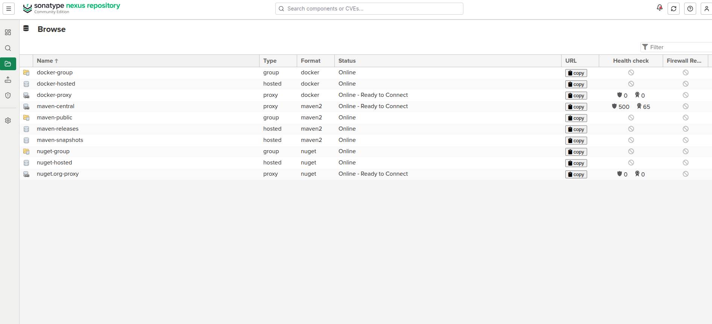

* **Maven Repositories:**
  * **Maven Central (`mc`):** `docs/screenshots/mc.png`  
    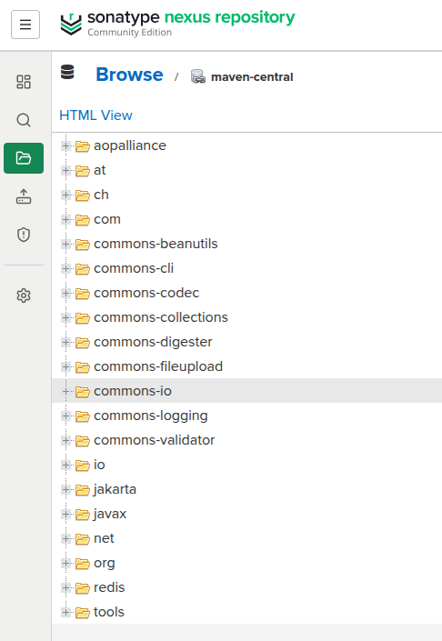
  * **Maven Public (`mp`):** `docs/screenshots/mp.png`  
    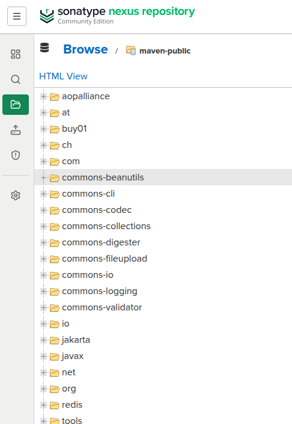
  * **Maven Releases (`mr`):** `docs/screenshots/mr.png`  
    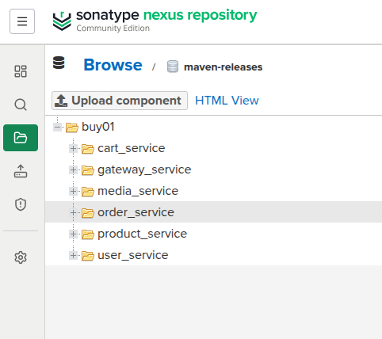
  * **Maven Snapshots (`ms`):** `docs/screenshots/ms.png`  
    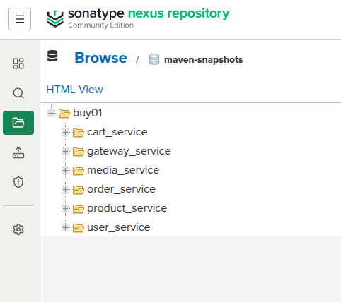

* **Docker Registries:**
  * **Docker Hosted (`dh`):** `docs/screenshots/dh.png`  
    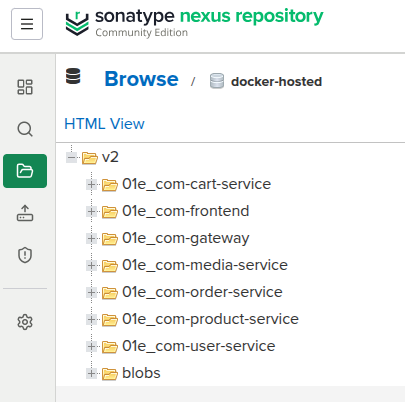
  * **Docker Proxy (`dp`):** `docs/screenshots/dp.png`  
    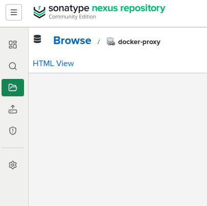
  * **Docker Group (`dg`):** `docs/screenshots/dg.png`  
    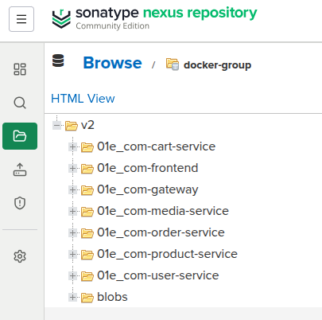

---

### 2. Pipeline Execution & Integration
* **Nexus Connection:** `docs/screenshots/linkingwithnexus.png`  
  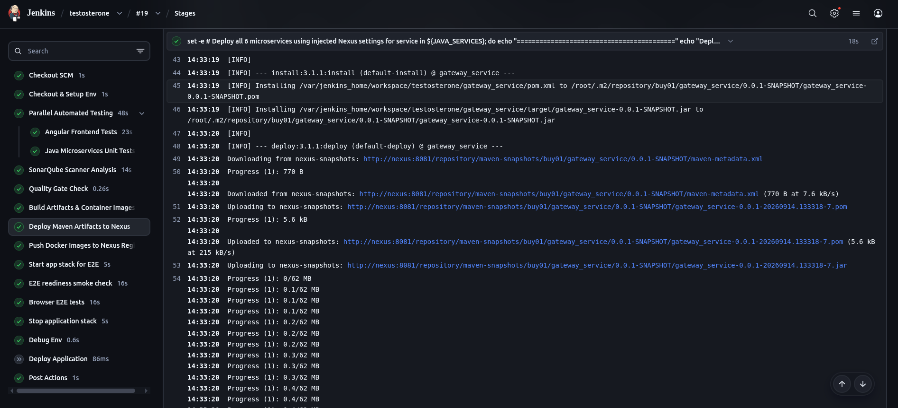
* **Push Artifacts to Nexus:** `docs/screenshots/pushtonexus.png`  
  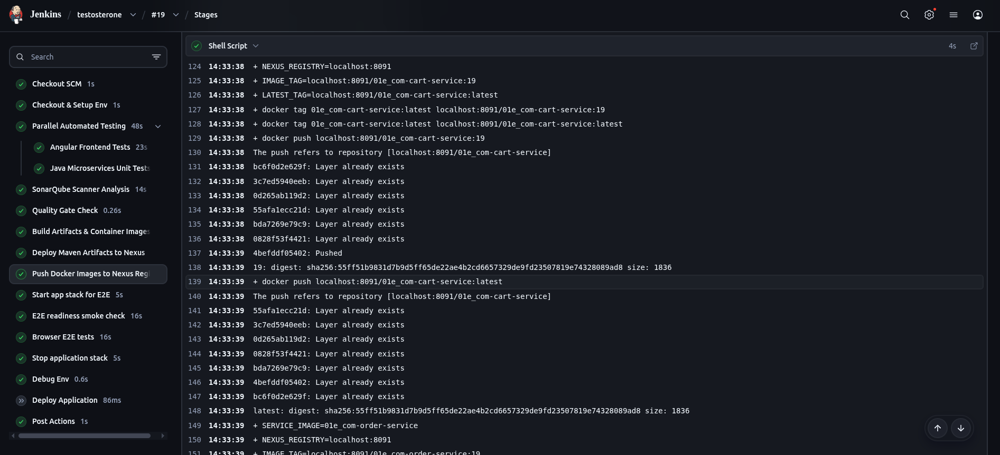
* **Jenkins Pipeline Execution:** `docs/screenshots/pipeline.png`  
  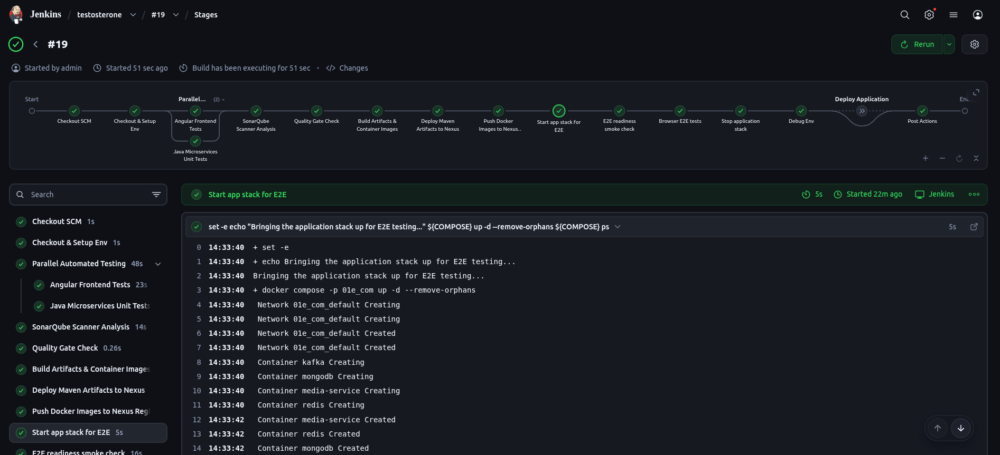

---

### 3. Quality & Testing
* **SonarQube Quality Gate:** `docs/screenshots/quality.png`  
  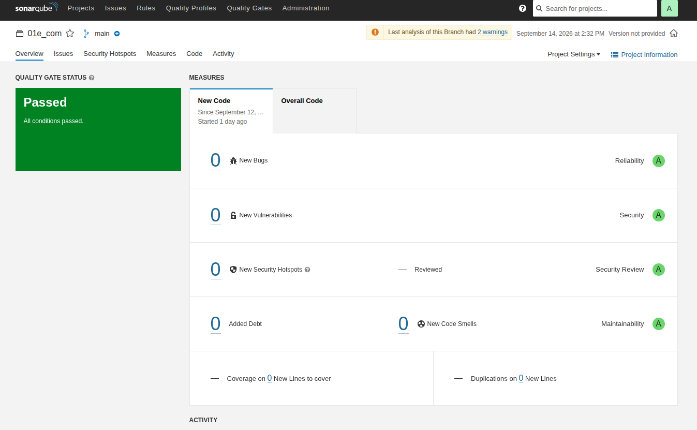
* **SonarQube Logs:** `docs/screenshots/qualitylogs.png`  
  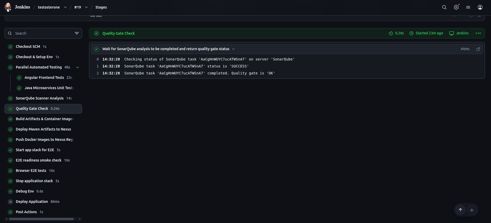
* **Playwright E2E Tests:** `docs/screenshots/e2etests.png`  
  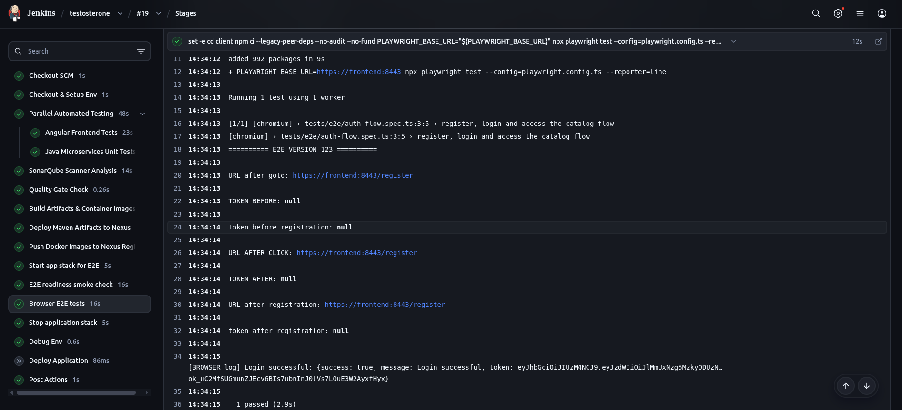
---

## 🛠️ Local Development & Setup

### Prerequisites
* JDK 21
* Node.js 20+ & npm
* Docker & Docker Compose
* Local Nexus 3 instance

### 1. Build Microservices Locally
To build all Java microservices using the custom Nexus proxy settings:

```bash
for service in gateway_service user_service product_service media_service cart_service order_service; do
  (cd "$service" && ./mvnw clean package -DskipTests)
done
```

### 2. Start Application Stack
Bring up the entire environment using Docker Compose:

```bash
docker compose -p 01e_com up -d --build
```

Access the application endpoints:
* **Frontend UI:** `https://localhost:8443`
* **API Gateway:** `https://localhost:8089`

### 3. Run E2E Tests Manually
Navigate to the client directory and run Playwright tests:

```bash
cd client
npm ci --legacy-peer-deps
PLAYWRIGHT_BASE_URL="https://localhost:8443" npx playwright test
```

---

